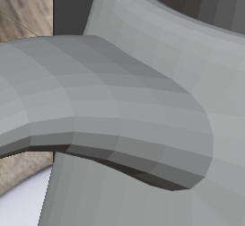

F3 for menu with all commands

center on currently selected object: Numpad 0 or "Frame selected" (F3)

` + number (or click)

F9 last used command (useful for when you just created an object and lost the popup)

add "thickness" -> modifiers > "solidify"

Shift + A (Add)

g - grab
s - scale
r - rotate

! ORDERS OF MODIFIERS MATTERS !

modifier -> generate -> solidify (add thickness)

geometry -> subdivision -> apply
so that subsequent changes to our model do not mess up the geometry we saved - see https://www.youtube.com/watch?v=z-Xl9tGqH14&t=2775s

clear normals - Shift N

when in EXTRUDE

hold ctrl + right click = extrude along normals (along the faces)

if you have this problem:

Object Mode > select object > right click > shade smooth